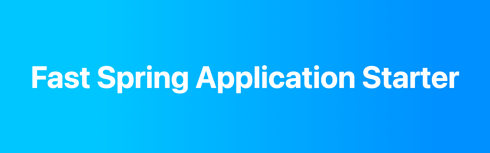

<h1 align="center">
    
</h1>

## 소개
안녕하세요. 전지환입니다.

매번 새 프로젝트를 개발하려고 하면 초기 환경 세팅 때문에 많은 시간을 쓰곤 하는데요.  
제가 만든 데모 애플리케이션은 최대한 스프링 애플리케이션에 공통으로 사용되는 라이브러리와 설정값을 넣었습니다.  
제 데모를 이용해보니 이런 라이브러리도 필요한 것 같다, 이런 설정값도 필요한 것 같다. 하는 부분 issue로 제안해주세요.

감사합니다.

## 프로젝트 구성
```
- Dependencies

Spring Web
Spring Data JPA
querydsl-jpa
Lombok
Validation
H2 Database
Mockito
Spring REST Docs (Junit 5 + Mockito)
Spring REST Docs API specification Integration
```

## 시작하기
* git clone 
    * `git clone https://github.com/jyeonjyan/springboot-starter [your project name]`

* IntelliJ 에서 프로젝트 이름 바꾸기
    1. Go to File >> Project Structure >> Project > Project Name Update project name with its new name
    2. Exit IntelliJ IDEA
    3. Edit contents of the following files
        * {project_root}/settings.gradle
        * {project_root}/.idea/.name (if exists)
    4. Open IntelliJ IDEA
    5. Refresh Gradle Project
    6. Change app package name like `com.app.yourprojectname`
    7. Change app entry point class name like `YourApplication.java`
    8. Run `YourApplication.java`
    

## 애플리케이션 설정
* 애플리케이션은 기본적으로 `8080` 포트에서 실행돼요.
  
* H2 Database 사용하는 법
    * Embedded and server modes [설치형 DB](https://github.com/jyeonjyan/TIL/blob/master/DevFeed/h2db.md)
    * disk-based or in-memory databases [인메모리 DB](http://localhost:8080/h2-console)

* Querydsl 사용하는 법
    * IntelliJ 환경설정에서 annotation processing 을 활성화 해요.
    * Q-class를 생성하려면 Gradle 작업창에서 `Gradle/Tasks/other/compileQuerydsl.sh` task를 누르거나 `./gradlew clean build` 명령어를 이용해요.
    * Q-class는 `project/build/generated/querydsl/` 여기에 생성돼요.
    * 자세한 내용은 [여기를](http://querydsl.com/) 참고하세요.
    
* Swagger 사용하는 법
    * Swagger 설정은 `src/main/**/demo/config/SwaggerConfig.java` 에 있어요.
    * 기본적으로 `@Profile("dev")` dev profile 에서만 사용 가능하게 해뒀어요. 
    * Swagger는 `http://localhost:8080/swagger-ui.html` 에 마운트 돼 있어요.
    * 자세한 내용은 [여기를](https://swagger.io/) 참고하세요.

* Spring REST Docs 사용하는 법
    * Swagger 는 API 문서화 도구로 사용하기에는 아쉬운 부분이 많아요. 그래서 REST Docs을 준비했어요.
    * Controller Test 를 통과해야지만 문서가 만들어져요. [예제](src/test/java/com/app/demo/docs/UserInfoDocumentationTests.java)는 MockMvc, mockito, junit5 로 테스트 했어요.
    * 테스트가 통과하면 `build/generated-snippets/**`에 스니펫(.adoc)들이 생성돼요.
    * `src/docs/asciidoc/**.adoc` 으로 API spec 페이지를 구성해주세요.
        * `.adoc` 파일 작성 방법에 대한 자세한 내용은 [여기를](https://asciidoctor.org/docs/asciidoc-writers-guide/#a-new-perspective-on-tables) 참고하세요.
    * `./gradlew build` 시 `build/asciidoc/html5/**`에 html로 변환된 API spec 페이지가 생성될 거예요.

* Spring REST Docs API spec 사용하는 법